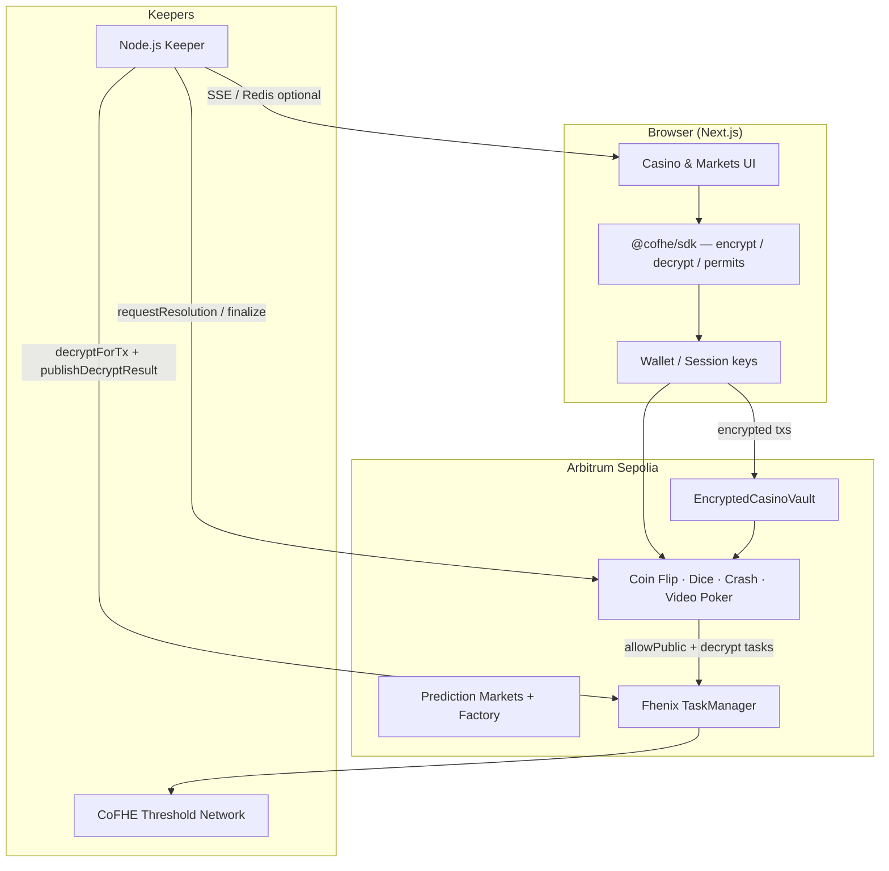

<div align="center">

# CasFin

**Encrypted casino & prediction markets on Arbitrum Sepolia**

Play, stake, and resolve markets while wagers and balances stay **encrypted on-chain** — powered by [Fhenix CoFHE](https://cofhe-docs.fhenix.zone/), not plaintext “provably fair” rails.

<br />

[**Live Demo**](https://casfin-frontend.vercel.app/) · [**Contracts**](https://sepolia.arbiscan.io/address/0xA6406C70FaF7E86B9B8b1cdbC21F7148f6d3E175) · [**Developer Setup**](./casfin/README.md) · [**FHE Reference**](./casfin/FHENIX_COFHE_REFERENCE.md)

<br />

[](https://casfin-frontend.vercel.app/)
[](https://sepolia.arbiscan.io/)
[](https://cofhe-docs.fhenix.zone/)
[](https://github.com/Anu062004/CasFin/tree/main/casfin/contracts)

<br />

| **Judges** — verify in minutes | **Developers** — clone & run |
| --- | --- |
| Deposit → play encrypted games → inspect FHE contracts on Arbiscan | `cd casfin && npm install && npm run compile && npm run frontend:dev` |

</div>

---

## Executive summary (for judges)

CasFin demonstrates that a full casino and prediction-market stack can run on a **transparent L2** while keeping **stakes, balances, and game inputs encrypted on-chain**. Unlike “provably fair” casinos where every bet is visible to bots and analysts, CasFin uses **Fhenix CoFHE** so smart contracts compute over ciphertext—only the player’s wallet (with an explicit permit) decrypts outcomes locally.

| What judges can verify quickly | How |
| ------------------------------ | --- |
| Encrypted deposit & play | Connect wallet on Arbitrum Sepolia → deposit to vault → play Coin Flip / Dice / Crash / Video Poker |
| On-chain FHE math | Inspect `EncryptedCasinoVault` and game contracts on Arbiscan |
| Async resolution | Keeper finalizes encrypted bets after CoFHE threshold decryption |
| Transparent rail | Factory-deployed prediction markets with AMM, disputes, and fees |

---

## The problem

On public blockchains, casino activity is fully observable:

- **Balances** reveal bankroll and risk appetite  
- **Open bets** expose strategy to MEV searchers and copy-traders  
- **Timing** of deposits and withdrawals enables profiling of winners  

CasFin’s encrypted rail treats wagers and vault balances as **FHE types** (`euint128`, `euint8`, `ebool`). Contracts never need plaintext during play; decryption is **client-side** via `@cofhe/sdk` and **async on-chain** via the Fhenix TaskManager for settlement.

---

## Architecture



**Resolution flow (encrypted games):**

1. Player submits encrypted bet (`placeBet` / `deal`)  
2. Keeper calls `requestResolution` → contract marks public decrypt handles  
3. Keeper runs `decryptForTx` off-chain, then `publishDecryptResult` on-chain  
4. Keeper calls `finalizeResolution` → vault `settleBet` with encrypted payout  

See [`casfin/FHENIX_COFHE_REFERENCE.md`](./casfin/FHENIX_COFHE_REFERENCE.md) for ACL, error decoding, and keeper checklists.

---

## Product surfaces

### Encrypted casino (Fhenix)

| Game | Description | Resolution |
| ---- | ----------- | ------------ |
| **Dark Coin Flip** | Encrypted heads/tails guess vs encrypted outcome | Keeper (2-tx async) |
| **Encrypted Dice** | Roll-under with encrypted target | Keeper (2-tx async) |
| **Confidential Crash** | Encrypted cash-out vs encrypted crash point | Keeper (round lifecycle) |
| **Video Poker** | Jacks or Better — deal, hold, draw on encrypted cards | Operator / resolver (manual 2-tx today) |

**Shared infrastructure**

- **EncryptedCasinoVault** — single encrypted balance for all games; session keys for gasless repeat play  
- **GameRandomnessLib** — FHE-native randomness for outcomes and cards  
- **CoFHE React provider** — browser TFHE runtime, encrypt inputs, `decryptForView` with self-permit  

### Transparent prediction markets

- Market factory, AMM-style trading, LP shares  
- Resolution, dispute registry, fee distributor  
- Optional sports markets (BallDontLie API integration in frontend)  

### UX

Production-oriented **“Midnight Nebula”** UI: glassmorphism, live protocol reads, operator tools, and FHE session progress indicators.

---

## Technology stack

| Layer | Stack |
| ----- | ----- |
| Contracts | Solidity `^0.8.25`, Hardhat, `@fhenixprotocol/cofhe-contracts` |
| FHE client | `@cofhe/sdk` ^0.5.x, TFHE in-browser (lazy-loaded) |
| Frontend | Next.js 15, React 19, TypeScript, Ethers v6, Privy / injected wallets |
| Keepers | Node.js (`keeper/index.ts`), optional AWS Lambda package |
| Data | Prisma + Postgres (indexer), Redis (optional SSE) |
| Network | **Arbitrum Sepolia** (chain id `421614`) |

---

## Testnet deployment (Arbitrum Sepolia)

Default addresses used by the live frontend (override via `frontend/.env.local`):

| Contract | Address |
| -------- | ------- |
| EncryptedCasinoVault | `0xA6406C70FaF7E86B9B8b1cdbC21F7148f6d3E175` |
| EncryptedCoinFlip | `0xBD4F422FCbA6e197729074eB0eA41Fdb805Bc71C` |
| EncryptedDiceGame | `0xc95b343bA9dfd00e6a345Eb552FD3a4576EfCBb7` |
| EncryptedCrashGame | `0xB68F64AbC208e5c011Cb2D6e23f52Aa43599e5Ee` |
| EncryptedVideoPoker | `0x843fDBE340a02b41002E986d347246C6E3bE063F` |
| MarketFactory | `0x6753A055CC37240De70DF635ce1E1E15cF466283` |

Explorer: [sepolia.arbiscan.io](https://sepolia.arbiscan.io/)

---

## Quick start (developers)

### Prerequisites

- Node.js 20+  
- Arbitrum Sepolia ETH (wallet + deployer/keeper key)  
- RPC URL (Alchemy/Infura recommended for keeper log backfill)  

### Install & test

```bash
git clone https://github.com/Anu062004/CasFin.git
cd CasFin/casfin

npm install
npm --prefix frontend install
npm run compile
npm test
```

### Run locally (two terminals)

**Terminal 1 — frontend**

```bash
npm run frontend:dev
# http://localhost:3000
```

**Terminal 2 — keeper** (required for Coin Flip / Dice / Crash settlement)

```bash
# Root .env: ARBITRUM_SEPOLIA_RPC_URL, PRIVATE_KEY, game addresses
npm run keeper:start
```

Copy environment templates from `casfin/.env.example` and `casfin/frontend/.env.example`.

### Deploy contracts

```bash
npm run deploy:prediction   # transparent markets
npm run deploy:casino       # legacy transparent casino stage
npm run deploy:full         # full stack / FHE stage (see scripts/)
npm run authorize:games     # re-authorize games on vault if needed
```

Deployment snapshots are written under `casfin/deployments/<network>/`.

---

## Repository layout

```text
CasFin/
├── README.md                 ← You are here (judges & onboarding)
└── casfin/                   ← Application monorepo
    ├── contracts/            Solidity (fhenix/, markets, casino)
    ├── frontend/             Next.js app + CoFHE provider
    ├── keeper/               Casino + prediction keepers (+ lambda/)
    ├── scripts/              Hardhat deploy & ops
    ├── test/                 Hardhat + FHE mock tests
    ├── FHENIX_COFHE_REFERENCE.md
    └── README.md             ← Extended developer notes
```

---

## FHE design highlights (technical judges)

- **ACL discipline:** `FHE.allowThis`, `FHE.allow(player)`, `FHE.allowSender`, and `FHE.allowPublic` used intentionally per handle lifecycle ([Fhenix access control](https://cofhe-docs.fhenix.zone/fhe-library/core-concepts/access-control)).  
- **No legacy `FHE.decrypt` in new paths:** off-chain `decryptForTx` + on-chain `publishDecryptResult`.  
- **Session keys:** ephemeral signer for repeat bets; vault `resolvePlayer` maps session → owner; CoFHE decrypt falls back across wallet + session clients.  
- **Encrypted vault accounting:** reserve / settle / withdraw with encrypted comparisons (`FHE.gte`, `FHE.select`).  
- **Video Poker:** encrypted deal/draw with client-side card `decryptForView`; resolution decrypts final hand on-chain for payout multiplier.  

---

## Keeper operations

The combined keeper (`npm run keeper:start`):

- Listens for `EncryptedBetPlaced`, dice/crash events (WSS + polling backfill)  
- Drives `requestResolution` → CoFHE decrypt publish → `finalizeResolution`  
- Runs prediction market expiry resolution in parallel  
- Optional Redis for SSE bet updates (UI only; chain settlement does not depend on Redis)  

**Video Poker** is not wired into the keeper today; resolution is triggered from the operator UI (`requestResolution` / `finalizeResolution`).

Diagnose stuck bets:

```bash
npx ts-node keeper/diagnose-bets.ts
```

Decode CoFHE reverts:

```bash
npx cofhe-errors <selector>
```

---

## Documentation index

| Document | Audience |
| -------- | -------- |
| [`casfin/README.md`](./casfin/README.md) | Deep dive: env vars, keeper config, UI notes |
| [`casfin/FHENIX_COFHE_REFERENCE.md`](./casfin/FHENIX_COFHE_REFERENCE.md) | CoFHE troubleshooting & ACL checklist |
| [`casfin/fix.md`](./casfin/fix.md) | Known game-logic caveats |
| [Fhenix CoFHE docs](https://cofhe-docs.fhenix.zone/) | Official FHE / SDK reference |

---

## Security & scope

- **Unaudited research / hackathon codebase** — not production-ready for real funds.  
- **Transparent markets** remain fully public by design.  
- **Encrypted rail** privacy depends on CoFHE ACL, wallet permits, and correct client integration.  
- **Centralization:** keeper and (for poker) operator resolution are trusted roles in v1.  

---

## Contributing

Issues and PRs are welcome on [Anu062004/CasFin](https://github.com/Anu062004/CasFin). Development happens primarily in `casfin/`. Run `npm test` and `npm --prefix frontend run typecheck` before submitting changes.

---

## Acknowledgments

Built with [Fhenix CoFHE](https://cofhe-docs.fhenix.zone/), deployed on [Arbitrum Sepolia](https://docs.arbitrum.io/), and inspired by the need for **confidential DeFi gaming** without leaving the composable EVM ecosystem.
